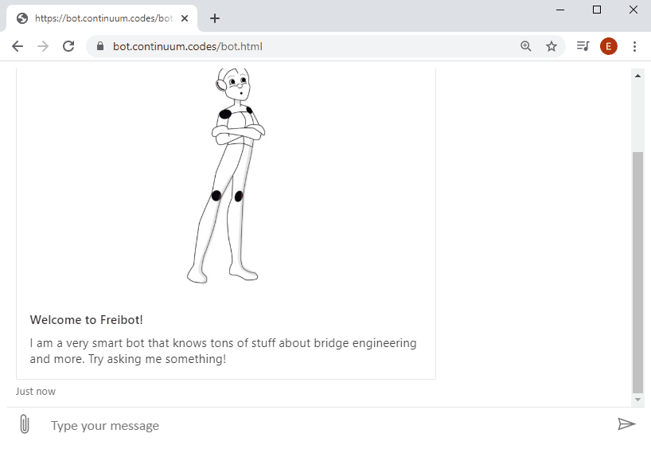

_The machine learning bot that improves knowledge-sharing and use of existing data within AEC companies_

## Background
The idea of this project came around as a conversation about how advanced parametric engineering tools will never be able to replace the power of senior staff with decades of experience in designing structures. They have the ability to quickly answer technical questions using their engineering judgement and provide accurate estimations dispite low-res input. On the other hand, a major asset of this knowledge source might be lost in case these senior engineers one day decide to leave the company. Fraiboto aims to address this issue by encapsulating this intelligence in an AI system.

## Result
Fraiboto (pronounced Frei Botto) is an AI based chatbot that encapsulates the collective intelligence of entire engineering organizations. She's able to give you design recommendations, help you to find people and projects in your organization, technical translations and even give you 3D snapshots of your projects models.

## Context and Team
Fraiboto was developed from scratch under 24 intense hours at the AEC Hackathon February 2020, in Copenhagen, Denmark. The team consisted of:

Sara Almstedt, Ramboll  
Felipe Bandeira, Ramboll  
Oyvind Fossum, Ramboll  
Emil Poulsen, CORE studio | Thornton Tomasetti  
Puria Safari Hesari, Rambol   
Milovann Yanatchkov, Continuum  

## Demo
5 verticals are shown in the gif below:  
The Senior – Answers technical questions  
Project data query – Shows drawings, 3D models, analytical models from existing projects  
The web of skills/resources – Directs you to an authority on the topic  
The technical translation – Does technical translation that Google Translate doesn’t know  
The assistant – Helps with registering expenses or booking flights  

## Tech stack
- ASP.NET Core backend
- MS Bot service and Luis.ai for natural language parsing
- Speckles API for 3d model view
- MS Bot UI in iframe for the front end (not in this repo)

## Roadmap
- General cleanup. Replace hardcoded hacks and csvs with air tables.
- Improve current services by providing more learn data
- Add additional engineering modules
- Automated BIM model scraping
- Add learning pipeline from intranet
- UI touchups – integrated 2D/3D viewer

## Running the app
- Clone the repo
- Get a luis.ai account and put the API keys in the appSettings.json. Note that you'll have to create appropriate intents, entities and data sets on your own to train you bot. See further instructions in [Corebot1](/Corebot1)
- Run the server
- Use Bot Framework emulator to interact with the bot by providing the localhost port your backend is running on.

## Caveats
As mentioned, everything in the repo was developed during the hackathon, so be aware the state of the code is rough. We used the MS Bot "Core" example as a starting point, which will become aparent after further inspection of the source. The bot's training set is limited, which means that it your conversation intents may be incorrectly mapped and interpreted by Fraiboto wrong.

Cred for the bot's name goes to [Frei Otto](https://en.wikipedia.org/wiki/Frei_Otto). 

## License
[MIT](LICENSE).

